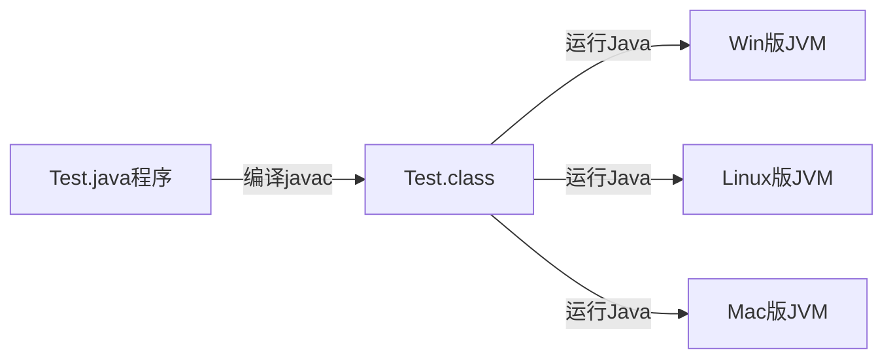
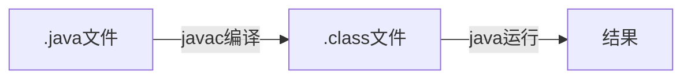
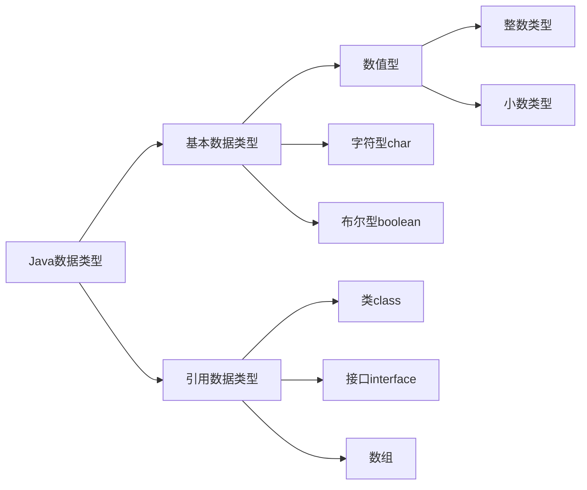
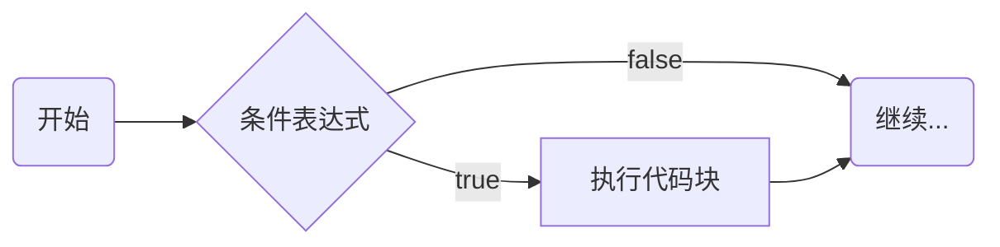
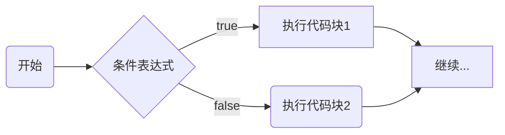
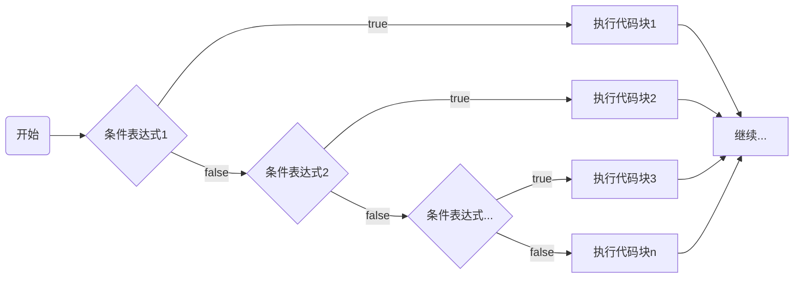
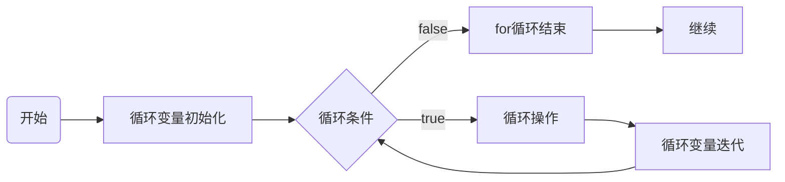

# 一、基础内容篇

## 1.1 Java概述

### 1.1.1 Java特点

*   Java语言是面向对象的
    
*   Java语言是健壮的（异常处理、垃圾自动收集、强类型机制）
    
*   Java语言是跨平台的（可以多系统下运行）
    
*   Java语言是解释性的（不能直接被机器执行，需要解释器）
    

> 解释性语言：JavaScript，PHP，Java 编译性语言：c/c++

### 1.1.2 Java运行机制及运行过程：跨平台性



*   JVM：JVM是虚拟的计算机，具有指令集并使用不同的存储区域，负责执行指令，管理数据、内存、寄存器，包含在JDK中。
    
*   对于不同平台有不同虚拟机。（JVM for Linux、JVM for Windows、JVM for Mac）
    
*   Java虚拟机机制屏蔽了底层运行平台的差别。
    

### 1.1.3 JDK和JRE

1. jdk（Java Development Kit Java开发工具包）

JDK = JRE + Java开发工具（Java，Javac，Javadoc，javap等）

提供给Java开发人员用，包含了jre。

2. jre（Java Runtime Environment Java运行环境）

JRE = JVM + Java核心类库（Java SE标准类库）

> 如果想要运行一个开发好的Java程序（.class文件），只需要jre。

### 1.1.4 注意事项



1.  Java源文件以`.java`为拓展名，基本组成部分是类(class)。
2.  Java应用程序的执行入口是`main()`方法。`public static void main(String[] args){…}`
3.  Java严格区分大小写。
4.  Java方法由语句构成，每个语句以“;”结束。
5.  大括号成对出现。
6.  一个源文件中最多只能有一个public类。如果源文件中包含一个public类，文件名为该类名。
7.  可以将main方法写在非public类中，指定运行非public类，入口方法为非public的main方法。

```java
public class Hello{
    //编写main方法
    public static void main(String[] args){
        System.out.println("Hello!");
    }
}
```

### 1.1.5 转义字符

| 符号     | 字符含义                 |
|--------|----------------------|
| `\n`     | 换行 (0x0a)            |
| `\r`     | 回车 (0x0d)            |
| `\f`     | 换页符(0x0c)            |
| `\b`     | 退格 (0x08)            |
| `\0`     | 空字符 (0x0)            |
| `\s`     | 空格 (0x20)            |
| `\t`     | 制表符                  |
| `\"`     | 双引号                  |
| `\'`     | 单引号                  |
| `\\`     | 反斜杠                  |
| `\ddd`   | 八进制字符 (ddd)          |
| `\uxxxx` | 16进制Unicode字符 (xxxx) |


### 1.1.6 注释

1.  单行注释 `//`
2.  多行注释 `\* \*`    
3.  文档注释 `\*\* \*`

>注意：多行注释不允许嵌套

### 1.1.7.DOS命令

相对路径：从当前目录开始定位

绝对路径：从顶级目录开始定位（从c盘开始）

1.  查看当前目录 `dir d:\\abc\\test`
2.  切换其他盘 `cd /D c:\\`
3.  切换到当前盘其他路径 `cd d:\\abc\\test cd …\\…\\abc\\test`
4.  切换到上一级 `cd…`
5.  切换到根目录 `cd\\`
6.  查看指定目录下所有子级目录 `tree`
7.  清屏 `cls`
8.  退出DOS `exit`

## 1.2 变量

### 1.2.1 基本概念

变量：变量是程序的组成单位。相当于内存中一个数据存储空间的表示（门牌号）。

三要素：类型 + 名称 + 值

### 1.2.2 变量使用（先声明，后使用）

1.  声明变量
    
    ```java
    int a;
    ```
    
2.  赋值
    
    ```java
    // 把10赋给a
    a = 10;
    ```

3. `+` 号的使用：

    *   左右两边都为数值型时，为加法运算。
    *   左右两边有一方为字符串，为拼接运算。
    *   “hello” + 100 + 3 => hello1003

### 1.2.3 数据类型

世界万物为由元素周期表中基本元素组成，基本数据类型相当于化学中基本元素，而对象就相当于世界万物。




1. 整数类型

| 类型  | 占用存储空间 | 范围  |
| --- | --- | --- |
| `byte[字节]` | 1字节 | \-128 ~ 127 |
| `short[短整型]` | 2字节 | \-2<sup>15</sup> ~ 2<sup>15</sup> \-1 |
| `int[整型]` | 4字节 | \-2<sup>31</sup> ~ 2<sup>31</sup>\-1 |
| `long[长整型]` | 8字节 | \-2<sup>63</sup> ~ 2<sup>63</sup>\-1 |

> Java整型常量默认为int类型，声明long型常量后加’l’或’L’。
> 
> bit是计算机中最小存储单位，byte是计算机中基本存储单元。1 byte = 8 bit。

2. 浮点数

| 类型  | 占用存储空间 | 范围  |
| --- | --- | --- |
| 单精度float | 4字节 | \-3.403E38 ~ 3.403E38 |
| 双精度double | 8字节 | \-1.798E308 ~ 1.798E308 |

> 浮点数在机器中存放形式为 浮点数 = 符号位 + 指数位 + 尾数位
> 
> 尾数部分可能丢失，造成精度损失（小数都是近似值）：浮点数是不准确的。
> 
> 默认为double型，声明float型须加’f’或’F’。
> 
> 科学计数法形式表示：5.12e2\[5.12\*10<sup>2</sup>] 5.12E-2\[5.12\*10<sup>-2</sup>]

3. 字符类型

char表示单个字符，为两个字节，可存放汉字。

```java
char c1 = 'a'; 
char c2 = '\\t'; 
char c3 = '韩'; 
char c4 = 97;
```

> 字符常量是用单引号（‘’）括起来的单个字符。
> 
> char的本质是整数，拥有对应的Unicode码，可以进行运算，输出的是Unicode码对应的字符。

4. 布尔类型

boolean类型只允许取值true和false，无null，占用1个字节，一般用于程序流程控制。

### 1.2.4 字符编码表

*   ASCII码：美国信息互换标准代码，只规定了128个字符的编码。最高位置为0，后7位表示字符。对于美国够用。
    
*   ISO 8859-1(Latin-1)：0~127位与ASCII一样，128~255位中，128~159表示一些控制字符，160~255表示一些西欧字符。
    
*   Windows\-1252：与ISO 8859-1基本一样，区别只在128~159。更加全面，取代了ISO 8859-1编码。
    
*   GB2312：中文的第一个标准，针对简体中文常见字符，包括约7000个汉字和一些罕用词和繁体字。
    
*   GBK：建立在GB2312上，向下兼容，增加了14000个汉字，共约21000个汉字，包括繁体字。
    
*   GB18030：向下兼容GBK，增加了55000多个字符，共76000多个字符，包括了很多少数民族的字符及中日韩同意字符，使用变长编码。
    
*   Big5：针对繁体中文，广泛用于台湾和香港等地。
    
*   Unicode：给世界上所有字符都分配了唯一的数字编号，从0x000000~0xFFFF之间，一般写成十六进制在前面加U+，中文范围U+4E00~U+9FFF。兼容ASCII码。英文和汉字都占两个字节。
    
*   UTF-32：字符编号的整数二进制形式，四个字节。
    
*   UTF-16：变长字节，U+0000~U+FFFF两个字节表示，U+10000~U+10FFFF用四个字节表示。
    
*   UTF-8：变长字节，1~6个字节不等，字母占一个字节，汉字占3个。使用最广的Unicode实现方式。
    
    > 字符编码转换：一个字符从A编码到B编码，先找A编码格式，通过A的映射表找到其Unicode编号，然后通过Unicode编号再查B的映射表，找到字符的B编码格式。
    > 
    > 乱码原因：解析错误;解析错误且编码转换。
    > 
    > 乱码恢复：使用UltraEdit多次尝试；使用Java处理字符串的类String。
    

### 1.2.5 数据类型转换

1.  自动类型转化
    
    Java在进行赋值或者运算时，精度小的类型自动转换为精度大的数据类型。(从小到大排列)
    
    ```java
    int a = 'c';
    ```

    ```mermaid
    flowchart LR
        A[char]-->B[int]
        B-->C[long]
        C-->D[float]
        D-->E[double]
    ```
    
    ```java
    double b = 80;
    ```

    ```mermaid
    flowchart LR
        A[byte]-->B[short]
        B-->C[int]
        C-->D[long]
        D-->E[float]
        E-->F[double]
    ```
    
    > 表达式结果的类型将自动提升为操作数中最大的类型。
    > 
    > byte，short，char三者计算是会先转化为int类型。
    > 
    > 多种数据混合运算时，会先转化为容量最大的那种数据类型进行计算。
    
2.  强制类型转换
    
    自动转化的逆过程，将容量大的数据类型转化为容量小的数据类型，可能造成精度降低或溢出。
    
    ```java
    int i = (int)1.9;
    ```

    > 只针对最近的操作数有效，往往使用小括号提升优先级。
    > 
    > char可以保存int常量值但不能保存int变量值，需要强转。
    > 
    > byte、short、char类型运算时当作int类型处理。
    
3.  基本数据类型和String类型
    
    基本类型转String：`基本类型的值 + "" `
    
    ```java
    Sting str = n + "";
    ```

    String转基本类型：通过基本类型的包装类调用parseXX方法 
    
    ```java
    int n = Integer.parseInt(str);
    ```

    > 要确保String能转化为有效的数据，比如hello无法转化为一个整数。
    > 
    > 格式不正确会抛出异常，程序就会终止。
    

## 1.3 运算符

### 1.3.1 算术运算符

| 运算符 | 运算  | 范例  | 结果  |
| --- | --- | --- | --- |
| +   | 正号  | `+7`  | 7   |
| \-  | 负号  | `b = 11;-b` | \-11 |
| +   | 加   | `9 + 9` | 18  |
| \-  | 减   | `10 - 8` | 2   |
| \*  | 乘   | `7 * 8` | 56  |
| /   | 除   | `9 / 9` | 1   |
| %   | 取模（取余） | `11 % 9` | 2   |
| ++  | 自增（前）：先运算后取值； | `a = 2;b = ++a` | a = 3;b = 3 |
| ++  | 自增（后）：先取值后运算 | `a = 2;b = a++` | a = 3;b = 2 |
| –   | 自减（前）：先运算后取值； | `a = 2;b = --a` | a = 1;b = 1 |
| –   | 自减（后）：先取值后运算 | `a = 2;b = a–` | a = 1;b = 2 |
| +   | 字符串相加 | `"hel" + "lo"` | hello |

> 1. 前++：++i先自增后赋值；后++：i++先赋值后自增
> 
> 2. 整数之间做除法只保留整数部分舍弃小数，`int x = 10 / 3`的结果是3
> 
> 3. a % b = a - a / b 

### 1.3.2 关系运算符(比较运算)

*   关系运算的结果都为boolean型，为true或false。
*   关系表达式常用在if结构的条件或循环结构的条件中。

| 运算符 | 运算  | 范例  | 结果  |
| --- | --- | --- | --- |
| \= = | 相等于 | `8 == 7` | false |
| ！=  | 不等于 | `8 != 7` | true |
| <   | 小于  | `8 < 7` | false |
| \>  | 大于  | `8 > 7` | true |
| < = | 大于等于 | `8 < = 7` | false |
| \> = | 小于等于 | `8 > = 7 `| true |
| instanceof | 检查是否是类的对象 | `"hsp" instanceof String` | true |

### 1.3.3 逻辑运算符

用于连接多个条件，最终结果为boolean值。

*   逻辑与(&)：都为true，才为true，否则为false。条件都需要判断完才得出结果。
*   逻辑或(|)：只要有一个为true，就为true，都是false才是false。条件需要全部判断完才得出结果。
*   取反(!)：非运算，针对变量，true会变成false，false会变成true。
*   异或(^)：逻辑异或，两个相同为false，两个不同为true。
*   短路与(&&)：与 & 类似，如果第一个条件为false，后续不再判断，结果为false，效率高。
*   短路或(||)：与 | 类似，如果第一个为true，后续不再判断，结果为true，效率高。

### 1.3.4 赋值运算符

*   基本赋值运算符： =
*   复合赋值运算符： += ， -= ， /= ，\*= , %=
    *   `a += b;`等价于 `a = a + b;`其他同理。
*   特点：运算顺序从右往左；赋值运算符左边只能是变量；复合赋值运算符会进行类型转化。

###  1.3.5 三元运算符

基本语法：条件表达式 ？ 表达式1 ：表达式2 ;

运算规则：条件表达式为true，运算结果为表达式1；条件表达式结果为false，运算结果为表达式2。

### 1.3.6 运算符优先级

最高优先级的运算符在的表的最上面，最低优先级的在表的底部。

| 类别  | 操作符 | 关联性 |
| --- | --- | --- |
| 后缀  | `()` `[]` `. (点操作符)` | 左到右 |
| 一元  | `expr++` `expr–-` | 从左到右 |
| 一元  | `++expr` `--expr` `+` `-`  | 从右到左 |
| 乘性  | `*` `/` `%` | 左到右 |
| 加性  | `+` `-` | 左到右 |
| 移位  | `>>` `>>>` `<<` | 左到右 |
| 关系  | `>` `>=` `<` `<=` | 左到右 |
| 相等  | `\==` `!=` | 左到右 |
| 按位与 | `&`  | 左到右 |
| 按位异或 | `^`| 左到右 |
| 按位或 | `\|`  | 左到右 |
| 逻辑与 | `&&`  | 左到右 |
| 逻辑或 | `\|\|` | 左到右 |
| 条件  | `?：`  | 从右到左 |
| 赋值  | `\=` `+=` `-=` `*=` `%=` `>>=` `<<=` `&=` `^=` `\|=` | 从右到左 |
| 逗号  | `,`  | 左到右 |

### 1.3.7 标识符命名规则规范及关键字

*   包名：多单词组成所有字母小写：aaa.bbb.ccc
*   类名、接口名：多单词组成是所有单词首字母大写：XxxYyyZzz\[大驼峰\]
*   变量名、方法名：多单词组成时，第一个单词首字母小写，后续单词首字母大写：xxxYyyZzz\[小驼峰\]
*   常量名：所有字母大写，多单词时各单词下划线连接：XXX\_YYY\_ZZZ
*   关键字：

| 定义数据类型 | class | interface | enum | byte | short | int |
| --- | --- | --- | --- | --- | --- | --- |
|     | long | float | double | char | boolean | void |
| 定于数据类型值 | true | false | null |     |     |     |
| 定义流程控制 | if  | else | switch | case | default | while |
|     | do  | for | break | continue | return |     |
| 定义访问权限修饰符 | private | protected | public |     |     |     |
| 定义类、函数、变量修饰符 | abstract | final | static | synchronized |     |     |
| 定义类与类之间关系 | extends | implements |     |     |     |     |
| 定义建立实例、引用实例、判断实例 | new | this | super | instanceof |     |     |
| 用于异常处理 | try | catch | finally | throw | throws |     |
| 用于包 | package | import |     |     |     |     |
| 其他修饰符 | native | strictfp | transient | volatile | assert |     |

*   保留字：尚未使用但可能使用，要避免使用的。byValue、cast、future、generic、inner、operator、outer、rest、var、goto、const

## 1.4 进制

### 1.4.1 概念

*   二进制：0，1 ，满2进1。以0b或0B开头。
*   十进制：0-9，满10进1。
*   八进制：0-7，满8进1。以数字0开头。
*   十六进制：0-9及A-F，满16进1，以0x或0X开头表示，a-f不区分大小写。

### 1.4.2 源码补码反码

*   二进制最高位为符号位，0正1负。
*   正数原码、补码、反码相同。
*   负数反码 = 原码符号位不变，其余取反。
*   负数补码 = 反码 + 1，负数反码 = 补码 - 1。
*   0的反码补码都为0。
*   计算机运算以补码的方式进行运算。但运算结果要看原码。

### 1.4.3 位运算

*   按位与(&)：两位都为1才为1。
    
*   按位或(|)：只要有一位为1，就为1。
    
*   按位取反(~)：1变为0，0变为1.
    
*   按位异或(^)：相异为1，相同为0.
    
*   左移(<<)：算数左移，向左移动，右边低位补0，高位舍弃，左移1位相当于乘以2。
    
*   无符号右移(>>>)：逻辑右移，向右移动，右边舍弃掉，左边补0.
    
*   有符号右移(>>)：算术右移，向右移动，右边舍弃，左边补什么取决于符号位，符号位为1，补1，符号位为0，补0.
    

## 1.5 程序控制结构

### 1.5.1 顺序控制

*   程序从上到下逐行执行，中间没有判断跳转。
*   Java中定义变量采用合法的向前引用。

### 1.5.2 分支控制

1. 单分支 `if`

*   基本语法：

```java
 if (条件表达式){
     执行代码块;（可以有多条语句
 }
```




2. 双分支 `if-else`

```java
if (条件表达式){
    执行代码块1;
}else{
    执行代码块2;
}
```

流程图：




3. 多分支 if-else if-…-else

```java
if (条件表达式1){
    执行代码块1;
}else if(条件表达式2){
    
}
......
else{
    执行代码块n;
}
```

流程图：




4. 嵌套分支

一个分支中又完整的嵌套了另一个完整的分支结构。

```java
 if(){
     if(){
         
     }
     else{
         
     }
 }
 else{
     
 }
```

5. switch分支结构

基本语法：

```java
switch(表达式){
        case 常量1;	//	当表达式的值等于常量1，执行语句块1
        语句块1;
        break;		//	break表示推出switch结构
        case 常量2;	//	如果表达式的值与常量1不匹配，则继续匹配常量2
        语句块2;
        break;
        ...
		case 常量n;
        语句块n;
        break;
        default;	//如果一个都没有匹配上。执行default
        dafault语句块;
        break;
}
```

> 如果判断的具体数值不多，符合byte、short、int、char、enum、String这六种类型，建议使用switch。
> 
> 对于区间判断，结果为boolean类型的判断，使用if，if范围更广。

### 1.5.3 循环控制

1. for循环

*   基本语法：

```java
 for(循环变量初始化; 循环条件; 循环变量迭代){
     循环操作;
 }
```

*   for循环四要素：①循环变量初始化；②循环条件；③循环操作；④循环变量迭代
    





2. while循环

基本语法：

```java
循环变量初始化;
while (循环条件){
    循环体;
    循环变量迭代;	//也有四要素但位置和for放的不一样
}
```

流程分析：

true

false

循环变量初始化

循环条件

循环体\\循环变量迭代

while结束

> 循环条件是返回一个布尔值的表达式；
> 
> while循环是先判断再执行语句

###### 3）do…while循环

基本语法：

```java
循环变量初始化;
do{
    循环体(语句);
    循环变量迭代；
}while(循环条件);
```

false

true

循环变量初始化

循环体\\循环变量迭代

循环变量判断

退出do..while

> do while是关键字，也有四要素。
> 
> 先执行再判断，一定会至少执行一次

###### 4）多重循环控制

*   将一个循环放在另一个循环体内，形成了嵌套循环。三种循环都可以作为外层和内层循环。
    
*   嵌套循环就是把内层循环当作外层循环的循环体，只有内层循环条件为false时，才会完全跳出内层循环，结束外层的当次循环，开始下一次循环。
    
*   设外层循环为 m 次，内层循环为 n 次，则内层循环需要执行 m\*n 次。
    

```java
for(int i = 1; i<= 7 ;i++){ 	//	第一层7
    for(int j = 1; i <=2;j++){	//第二层2
	System.out.println("ok~");	//7*2=14
    }
}
```

###### 5）continue和break

*   continue语句：用于结束本次循环，跳过本次循环内后续操作，继续执行下一次循环。在多层嵌套的循环体语句中，可以通过标签指明要跳过的时哪层循环。
*   break语句：用于提前结束循环，比如在数组中查找元素是，如果已找到，需要提前结束，可以使用break。
*   return语句：表示跳出所在方法

###### 6）foreach语句

基本语法：

```java
int[] arr = {1,2,3,4};
for(int element : arr){
    System.out.println(element);
}
```

foreach语句使用冒号 : ，冒号前是循环中的每个元素，包括数据类型和变量名称，冒号后是要遍历的数组或集合，每次循环element自动更新，只是简单便利的情况下，foreach语法更简洁。

#### 六、数组、排序、查找

##### 1.基本概念

*   数组：数据是一种数据类型，是引用类型，可以存放多个同一类型的数据。
    
*   数组的定义：
    

```java
数据类型 数组名[] = new 数据类型[大小]
    int arr[] = new int[5];
//数组的下标从0开始，例如引用第一个元素为arr[0]
先声明，后创建：
    int[] arr;
	arr = new int[10]

三种赋值形式：int a[] == int[] a
    1. int[] arr = {1,2,3};
	2. int[] arr = new int[]{1,2,3};
	3. int[] arr = new int[3];
		arr[0] = 1; arr[1] = 2; arr[2] = 3;
```

> *   数组不能再给定初始值的情况下同时给定长度，如`int[] arr = new int[3]{1,2,3};`
> *   数组中的元素可以是任何数据类型但是不能混用。
> *   数组创建后如果没有赋值，有默认值 int、short、byte、long为0，float、double为0.0，char为\\u0000，boolean为false，String为null
> *   数组属于引用类型，数组型数据是对象（object）
> *   数组在默认情况下是引用传递，赋的值是**地址**。占两块内存空间，栈中存数据地址，堆中存数据内容。

##### 2.排序

*   排序分类：
    *   内部排序：将需要处理的所有数据都加载刀内部存储器中进行排序，包括（交换式排序法、选择式排序法和插入式排序法）
    *   外部排序：数据量过大，无法全部加载刀内存中，需要借助外部存储进行排序，包括（合并排序法和直接合并排序发）
*   冒泡排序法：通过对排序序列从后向前（从下标较大的元素开始），依次比较相邻元素的值，若发现逆序则交换，使值较大的元素逐渐从前移向后部。

##### 3.查找

*   顺序查找
*   二分查找

##### 4.二维数组

<!-- *   语法：
    *   类型\[\]\[\] 数组名 = new 类型\[\]\[\] `int[][] a = new int[2][3]`
    *   数组名 = new 类型\[\]\[\] `int[][] a = new int[2][]`
    *   类型 数组名\[\]\[\] = {{值1，值2…}，{值1，值2…},…} `int[][] arr = {{1,1,1},{2,2},{3}}`
*   声明方式： `int[][] arr ;``int[] arr[];``int arr[][];` -->
